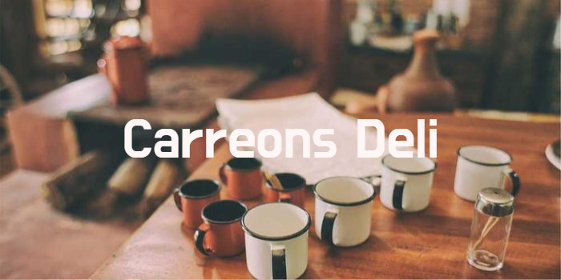

# CapstoneTwo_DeliApplication

## About

## Features

**Interactive**

- Easy-to-use menu system
- Cancel, return and exit features

**Custom sandwich builder** 

- Four choices of bread to select(toasting preference)
- Selection of meats, cheeses, toppings and sauces
- Pricing variation depending on size and extras

**Add Ons**

- Add a small, medium or large drink
- Selection of assorted chips

**Receipt summary**

- Custom receipts with total, date, time and item selection

## Files

## Key notes for code
- Integrates OOP
- Creates receipts and stores in separate directory 
- Separate class solely handling UI
## Future Improvements
- Implement AI features
- Add order history 
- Add custom sandwiches and specials
- Add misc. Items like fruits and vegetables
## Like this project?
Check out future projects to come, thanks!